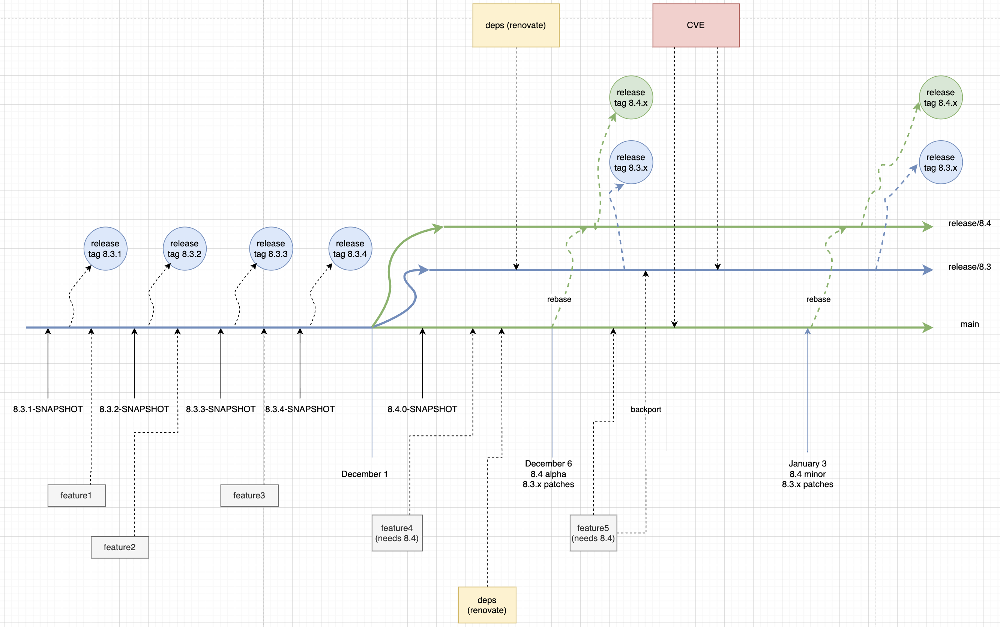

# ADR 1: Use multiple versions for releases
All this time, we were maintaining a single version for every Camunda minor, alpha and patch releases. There comes a need to start maintaining multiple versions because dependencies (whether upstream or downstream) wants to release early than the official release cadence. 

There are 2 options: either we fast forward to the latest minor / alpha version and move the rest of the codebase to use it, but that means we stop fixing bug fixes on the current stable version. Or we could maintain multiple versions (one for previous, one for stable, and the other for cutting edge)

## Decision
We will support multiple versions by using multiple branches:

`release/8.3` - Previous version - only bug fixes, dependency updates, CVEs and backports (if needed)

`release/8.4` - Current version - dependency updates, CVEs, new features

`main` - Same as the current version. Essentially a mirror copy

## Rationale
Describe here the rationale for the design decision. Also indicate the rationale for significant *rejected* alternatives. This section may also indicate assumptions, constraints, requirements, and results of evaluations and experiments.

Multiple branch approach is chosen as this doesn't confuse users as it offers isolated view. When they view the project, only one version is visible at a time. Other approach like multiple folders that houses different versions was not chosen due to overhead of loading multiple versions in the IDE and raises conflicts in packages. Multiple branches provides the cleanest experience.

Additionally, above will be the release process for multiple versions via release branches. 

## Status
Proposed

## Consequences
Moving from supporting single stable version to multiple versions will come with its own challenges such as but not limited to:
- how do we automate the rest of the process (rebase, backport)
- updating the correct branches for next iteration development version

We should use automation (github workflows) and avoid manual work as much as possible.

